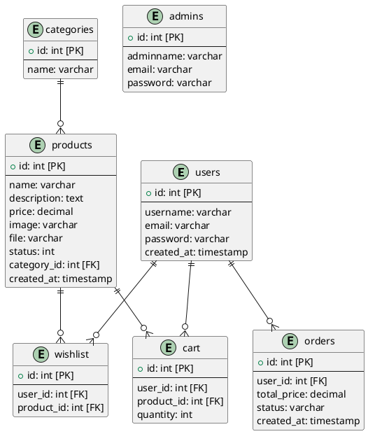
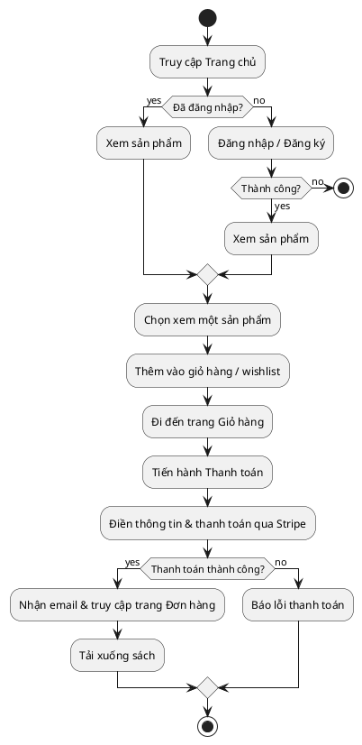
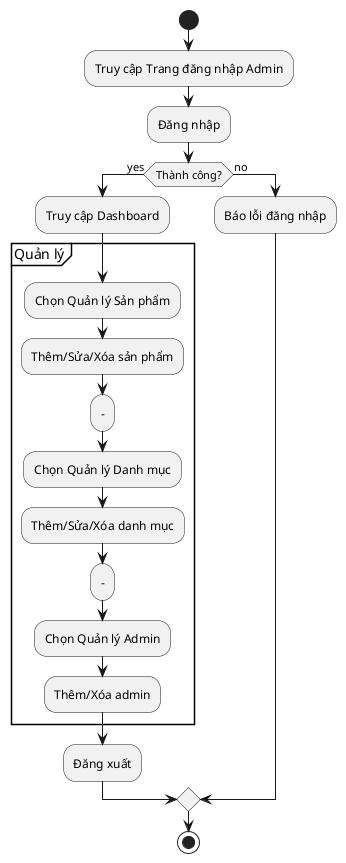

# Website Bán Sách - Phân Tích Kỹ Thuật

Dự án này là một hệ thống thương mại điện tử hoàn chỉnh được xây dựng bằng PHP thuần, tập trung vào việc cung cấp một nền tảng bán sách trực tuyến với đầy đủ chức năng cho cả người dùng và quản trị viên.

## 1. Cấu trúc Hệ thống & Thư mục

Hệ thống được tổ chức theo mô hình module, tách biệt rõ ràng giữa giao diện người dùng, trang quản trị, logic xử lý và các file cấu hình.

```
.
├── admin-panel/        # (ADMIN) Giao diện và logic cho trang quản trị
│   ├── admins/             # Quản lý (CRUD) tài khoản Admin.
│   ├── categories-admins/  # Quản lý (CRUD) danh mục sách.
│   ├── products-admins/    # Quản lý (CRUD) sản phẩm sách.
│   │   ├── books/          # Thư mục chứa file sách (PDF, EPUB) để tải xuống.
│   │   └── images/         # Thư mục chứa hình ảnh bìa sách.
│   ├── layouts/            # Chứa header và footer cho trang admin.
│   └── index.php           # Trang tổng quan (Dashboard) của admin.
│
├── auth/               # (USER) Xử lý đăng ký, đăng nhập, đăng xuất cho người dùng.
│
├── categories/         # (USER) Hiển thị sản phẩm theo từng danh mục.
│   └── single-category.php # Liệt kê tất cả sách trong một danh mục được chọn.
│
├── config/             # Chứa file cấu hình kết nối CSDL và các hằng số hệ thống.
│   └── config.php
│
├── includes/           # (USER) Chứa các thành phần UI tái sử dụng như header, footer.
│
├── shopping/           # (USER) Logic cốt lõi của quy trình mua sắm.
│   ├── cart.php            # Trang giỏ hàng.
│   ├── checkout.php        # Trang nhập thông tin và thanh toán.
│   ├── charge.php          # Xử lý giao dịch thanh toán qua Stripe API.
│   ├── single.php          # Trang xem chi tiết một sản phẩm.
│   ├── wishlist.php        # Trang danh sách sản phẩm yêu thích.
│   └── *.php               # Các file xử lý thêm/sửa/xóa sản phẩm trong giỏ hàng/wishlist.
│
├── SQL_FILE/           # Chứa file .sql để khởi tạo cơ sở dữ liệu.
│
├── vendor/             # Chứa các thư viện được cài đặt bởi Composer (vd: Stripe).
│
├── index.php           # Trang chủ của website.
├── download.php        # Logic xử lý việc cho phép người dùng tải file sách sau khi mua.
└── ...
```

## 2. Cơ sở dữ liệu (ER Diagram)

Dưới đây là biểu đồ quan hệ thực thể (ERD) mô tả cấu trúc CSDL của dự án, được biểu diễn bằng cú pháp PlantUML.



## 3. Luồng Logic Chức năng (Flowchart)

### Luồng Người dùng (User Flow)



### Luồng Quản trị viên (Admin Flow)



## 4. Các Đoạn Code Quan trọng (Snippets)

### a. Kết nối Cơ sở dữ liệu (PDO)

Logic kết nối CSDL được đặt tại `config/config.php` và được tái sử dụng trong toàn bộ dự án.

```php
// Trong config/config.php
define("HOST", "localhost");
define("DBNAME", "bookstore");
define("USER", "root");
define("PASS", ""); // Thay bằng mật khẩu của bạn

try {
    $conn = new PDO("mysql:host=".HOST.";dbname=".DBNAME."", USER, PASS);
    $conn->setAttribute(PDO::ATTR_ERRMODE, PDO::ERRMODE_EXCEPTION);
} catch(PDOException $e) {
    echo "Lỗi kết nối: " . $e->getMessage();
    die();
}

// Cách sử dụng ở các file khác
require "config/config.php";

$stmt = $conn->query("SELECT * FROM users LIMIT 5");
$users = $stmt->fetchAll(PDO::FETCH_OBJ);
```

### b. Logic CRUD (Ví dụ: Lấy danh sách sản phẩm)

Đây là ví dụ về cách thực hiện một truy vấn SELECT để đọc dữ liệu sản phẩm, sử dụng PDO prepared statements để chống SQL Injection.

```php
// Trong admin-panel/products-admins/show-products.php (giả định)

// 1. Chuẩn bị truy vấn
$query = "SELECT p.id, p.name, p.price, p.status, c.name AS category_name
          FROM products AS p
          JOIN categories AS c ON p.category_id = c.id
          ORDER BY p.created_at DESC";
$stmt = $conn->prepare($query);

// 2. Thực thi truy vấn
$stmt->execute();

// 3. Lấy dữ liệu
$products = $stmt->fetchAll(PDO::FETCH_OBJ);

// 4. Hiển thị dữ liệu trong bảng HTML
foreach ($products as $product) {
    echo "<tr>";
    echo "<td>" . htmlspecialchars($product->name) . "</td>";
    echo "<td>" . htmlspecialchars($product->category_name) . "</td>";
    echo "<td>$" . htmlspecialchars($product->price) . "</td>";
    // ... các cột khác và nút hành động (sửa, xóa)
    echo "</tr>";
}
```

### c. Xử lý Upload File (Ví dụ: Thêm sản phẩm mới)

Khi admin tạo sản phẩm mới, hệ thống cần xử lý việc upload hình ảnh bìa sách và file sách.

```php
// Trong logic xử lý của create-products.php (giả định)

if (isset($_POST['submit'])) {
    // ... lấy dữ liệu từ form (name, price, etc.)

    // Xử lý upload hình ảnh
    $image = $_FILES['image']['name'];
    $image_tmp = $_FILES['image']['tmp_name'];
    $image_dir = "images/" . basename($image);
    
    // Xử lý upload file sách
    $book_file = $_FILES['book_file']['name'];
    $file_tmp = $_FILES['book_file']['tmp_name'];
    $file_dir = "books/" . basename($book_file);

    // Di chuyển file đã upload vào thư mục đích
    if (move_uploaded_file($image_tmp, $image_dir) && move_uploaded_file($file_tmp, $file_dir)) {
        
        // Chuẩn bị câu lệnh INSERT vào CSDL
        $query = "INSERT INTO products (name, price, image, file, category_id) 
                  VALUES (:name, :price, :image, :file, :category_id)";
        
        $stmt = $conn->prepare($query);

        // Gán giá trị vào các tham số
        $stmt->bindParam(':name', $name);
        $stmt->bindParam(':price', $price);
        $stmt->bindParam(':image', $image);
        $stmt->bindParam(':file', $book_file);
        $stmt->bindParam(':category_id', $category_id);

        // Thực thi và chuyển hướng
        if ($stmt->execute()) {
            header("Location: show-products.php");
            exit();
        }
    } else {
        echo "Lỗi khi upload file.";
    }
}
```
